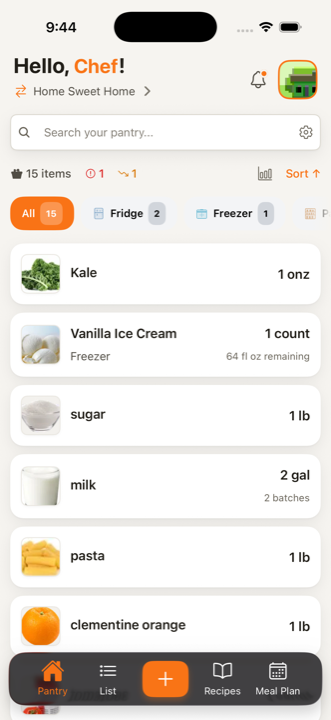
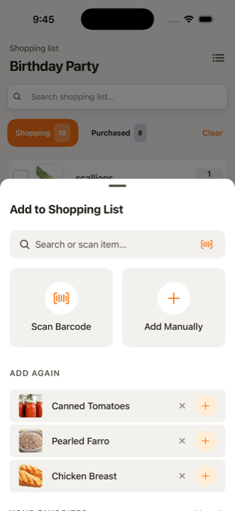
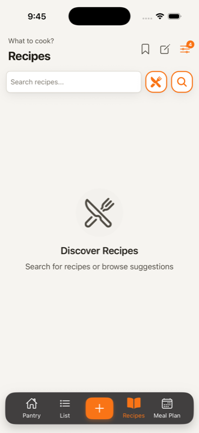
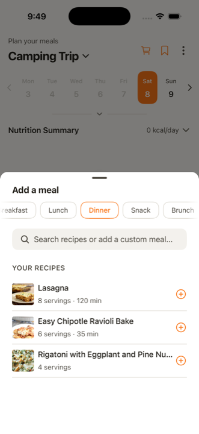

<div align="center">

# Sous Chef

**Know what's in your kitchen. Cook what you already have. Waste less.**

Sous Chef is a React Native app for running a real household kitchen — track
your pantry down to the batch, share shopping lists with the people you live
with, find recipes you can actually cook tonight, and plan a week of meals that
shops for itself. Built offline-first, so it works on the walk to the store and
syncs when you're back.






<sub>iOS · Pantry, shopping list, recipes, and meal planning</sub>

</div>

---

## What it does

The app is organized around four tabs — **Pantry**, **List**, **Recipes**, and
**Meal Plan** — with a central add button that adapts to wherever you are.
Homes, notifications, and settings live behind the header.

### 🧺 Pantry

Your kitchen inventory, tracked accurately enough to be useful.

- **Items with real quantities** — quantity + unit, with per-item **batches**
  (two half-gallons of milk bought on different days stay separate) and
  partial-container tracking ("64 fl oz remaining" on an opened tub).
- **Storage locations** — Fridge, Freezer, Pantry, and any custom location you
  define. Filter chips show live counts per location.
- **At-a-glance alerts** — expiring, expired, and low-stock counts in the header,
  so the things that need attention surface without hunting.
- **Fast entry** — add by **barcode scan** (camera), by searching a shared item
  catalog, or manually. Item photos come from the catalog automatically.
- **Item actions** — consume, restock, adjust quantity, correct weight, move
  between locations, and **record waste** with a reason (expired, spoiled,
  mold, pest, cooking fail, spilled, burnt, overstock, bad taste, gave away)
  plus composted/recycled flags.
- **Analytics** — Usage, Waste, and Ledger tabs over daily/weekly/monthly
  windows: usage trends, usage by purpose and source, waste rate and estimated
  value lost, top used / wasted / restocked items, total spent and average cost
  per unit.
- **Nutrition** — nutritional breakdown for what's on hand.
- **Search and sort** across the whole pantry, with a "not found — add it?"
  path straight from the search box.

### 🛒 Shopping lists

- **Multiple lists per home** with a quick switcher — "Birthday Party" and
  "Weekly Shop" coexist.
- **Shopping / Purchased tabs** with counts, and a one-tap clear.
- **Drag-and-drop reordering** that survives concurrent edits (fractional
  indexing, so two people reordering at once don't fight).
- **Add fast** — search, **barcode scan**, manual entry, plus an *Add Again*
  row of your recents and a favorites shelf.
- **Purchase history per item** — every purchase with quantity, price, and who
  bought it, rolled up into total spent and average price.
- **Real sharing** — invite by email or share code, with granular collaborator
  roles: viewer, shopper, contributor, editor, admin, owner. Updates arrive
  live over subscriptions while you're both in the store.

### 🍳 Recipes

- **Search a large external catalog** (Spoonacular) alongside your own recipes.
- **Filters** for diet (vegetarian, vegan, gluten-free, ketogenic, paleo,
  pescetarian, lacto-/ovo-vegetarian, primal, low-FODMAP, Whole30), 13
  intolerances, meal type, and max cook time.
- **Cook what you have** — suggestions ranked against your actual pantry, and a
  per-ingredient **available / partial / missing** breakdown on every recipe.
- **Save and organize** — saved recipes with folders, tags, and your own rating.
- **Write your own** — full editor with ingredient sections, per-ingredient
  preparation and notes, ordered steps, servings, prep/cook time, calories,
  difficulty, cuisine, and dietary tags.
- **Reviews and ratings** — star ratings with a distribution breakdown and
  written reviews.
- **"I Cooked This!"** — logs the cook and **deducts the ingredients from your
  pantry**, with a smart-deduction review step so you can adjust amounts before
  anything is subtracted.
- **Send missing ingredients to a shopping list** in one sheet.

### 📅 Meal planning

- **Weekly or monthly plans**, personal or shared with your home, with a start
  date, default servings, and an optional budget.
- **Week strip or full month calendar**, toggleable.
- **Breakfast, lunch, dinner, snack, and brunch** slots — fill them from your
  recipes, from search, or with a free-text custom meal.
- **Nutrition tracking** — daily averages and plan totals for calories,
  protein, carbs, and fat, with progress against your goals and data-coverage
  reporting.
- **Templates** — save a plan as a template, browse and preview templates, and
  build reusable meal templates from scratch.
- **Duplicate a plan** to next week in a couple of taps.
- **Generate a shopping list from a plan** — optionally checking pantry
  availability first, so it only adds what you're actually missing.

### 🏠 Homes & collaboration

- **Multiple homes** (your apartment, your parents' place) with a default and a
  fast switcher — each with its own pantries, lists, and members.
- **Member roles**: owner, admin, member, guest.
- **Join by invite email, join code, or deep link.**
- **Live sync** — GraphQL subscriptions push pantry and shopping-list changes to
  everyone in the home as they happen.

### 📴 Offline-first

- The Apollo cache is **persisted to device storage**, so a cold start paints
  real data before the network answers.
- **Writes work offline.** Mutations apply locally and queue; the queue replays
  automatically on reconnect.
- A banner tells you what's going on — offline, server unreachable, *N* changes
  pending, back online and syncing.
- An explicit **Offline Mode** toggle for when you want cached data only.

### 🔔 Notifications

- Push notifications (Firebase + Notifee) with an in-app inbox and detail view.
- Granular per-category control: expiration alerts, low stock, pantry updates,
  shopping-list updates, shared-list updates, collaboration invites, home
  invitations, recipe recommendations, and meal planning — across push, email,
  and SMS channels.

### 🎨 Personalization & accessibility

- **Appearance** — light / dark / system theme, six brand colors, three density
  settings, four font scales, and a high-contrast mode.
- **Four languages** — English, Spanish, Italian, and Albanian.
- **Units** — metric, imperial, or follow the system.
- **Dietary profile** — restrictions, favorite and disliked ingredients,
  nutrition goals, meals/snacks per day, cooking preferences (skill level, max
  prep and cook time, budget per meal), and advanced macro targets.
- Toggles for haptic feedback, tab-bar labels, and product images in lists.

### 🔐 Account & security

- Email/password auth with email verification (code or deep link) and password
  reset.
- **Biometric login** (Face ID / Touch ID / fingerprint) with credentials stored
  in the platform keychain, namespaced per account so shared devices don't leak.
- Profile photo upload with cropping, password change, and account deletion.
- A guided onboarding flow: create or join a home, set up a pantry and a
  shopping list, invite someone, add a photo, enable biometrics.

---

## How it works

Sous Chef is a **GraphQL client**. All durable data lives on a backend API; the
app's job is to make that data feel local.

| Concern | Approach |
| --- | --- |
| **Server state** | Apollo Client 4 — normalized cache, data masking, colocated fragments, persisted query manifest |
| **Device/UI state** | Zustand — selections, preferences, auth session, network status |
| **Offline** | Apollo cache persisted to MMKV + a mutation queue that replays on reconnect |
| **Realtime** | GraphQL subscriptions over `graphql-ws` |
| **Rendering** | React 19 with the React Compiler; Unistyles 3 pushes theme changes through the native ShadowTree instead of re-rendering |
| **Lists** | FlashList v2 everywhere a list can grow |
| **Types** | GraphQL Codegen generates `TypedDocumentNode`s next to each operation — no hand-written server types |

The code is organized into **self-contained feature modules** under
`src/features/`, each declaring what it contributes to navigation through a
manifest:

```
src/
├── features/          # Self-contained feature modules
│   ├── pantry/        # ├─ screens, components, hooks, graphql, manifest
│   ├── shoppingList/  # │
│   ├── recipes/       # │  Each feature has a small public surface
│   ├── mealPlan/      # │  (screens, manifest, top-level hooks);
│   ├── barcode/       # │  everything else is internal and
│   ├── notifications/ # │  lint-enforced against cross-feature reach.
│   ├── profile/       # │
│   └── registry.ts    # └─ Canonical feature list → tabs
├── screens/           # Cross-cutting screens (auth, home management, onboarding)
├── components/        # Shared UI — atoms, molecules, organisms, templates
├── hooks/             # Shared hooks (apollo, offline, ui, search, …)
├── apollo/            # Client, cache, links, offline queue, persistence
├── store/             # Zustand slices
├── navigation/        # Root navigator, tab bar, per-feature stacks
├── theme/             # Design tokens and Unistyles themes
├── services/          # Push, subscriptions, telemetry, recipe API, haptics
├── i18n/              # Locale files (en, es, it, sq)
└── graphql/           # Shared operations + generated schema types
```

Full detail — the feature API boundary, cache patterns, and the reasoning
behind each choice — is in [`docs/architecture.md`](docs/architecture.md).

---

## Getting started

```bash
git clone https://github.com/muzhaqi16/sous-chef-rn.git
cd sous-chef-rn
npm install            # also runs patch-package + generates src/config/env.generated.ts
cp .env.example .env   # fill in API_URL and friends
npm run codegen        # generate GraphQL types from the schema

npm start              # Metro
npm run ios            # iOS simulator (macOS + Xcode)
npm run android        # Android device or emulator
```

Requires Node `>= 22.11.0` and a working React Native environment. See
[`docs/development.md`](docs/development.md) for build variants, environment
files, codegen, testing, and the full command reference.

---

## Documentation

Start at **[`docs/README.md`](docs/README.md)** for the full index.

| | |
| --- | --- |
| [Architecture](docs/architecture.md) | How the app is built and organized |
| [Development](docs/development.md) | Setup, commands, build variants, testing |
| [Apollo patterns](docs/apollo-client-patterns.md) | Cache updates, fragments, optimistic responses |
| [Local-first architecture](docs/local-first-architecture.md) | Offline queue, conflict handling, sync |
| [Meal planning](docs/meal-planning.md) | Meal plan domain model |
| [Push notifications](docs/push-notifications.md) | FCM/APNs setup and routing |
| [CI/CD](docs/CI_CD.md) | Pipelines, environments, release tagging |

`CLAUDE.md` at the repo root holds the day-to-day coding conventions that AI
assistants and contributors are expected to follow.

---

## Built with

React Native 0.85 · React 19 + React Compiler · TypeScript · Apollo Client 4 ·
Zustand · React Navigation 8 · Unistyles 3 · Reanimated 4 · FlashList v2 ·
Skia + Victory Native · MMKV · Vision Camera · i18next · React Hook Form + Yup ·
Jest + React Native Testing Library · Detox

---

## Contributing

Contributions are welcome — see **[CONTRIBUTING.md](CONTRIBUTING.md)** for
setup, the development workflow, and the contribution license terms.

Before opening a PR:

```bash
npm run typecheck
npm run lint
npm test
```

---

## License

Licensed under the
[PolyForm Noncommercial License 1.0.0](LICENSE.md). You are free to use,
modify, and share this software for any noncommercial purpose. Commercial use
and redistribution are not permitted.

Required Notice: Copyright (c) 2026 Artan Muzhaqi
(https://github.com/muzhaqi16)
